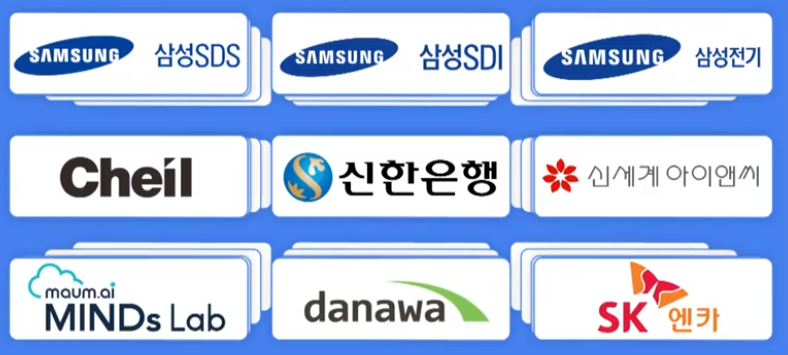

# 기업연계 프로젝트

> 1회 교보재 지급
>
> 기업 업종과 관련된 소프트웨어 주제로 프로젝트 수행

- 국내 우수 IT 기업의 현업 주제와 프로젝트 연계한 명세서 제공
- 기업 연계 프로젝트 희망하는 팀은 기업과 주제 신청
- 현직 개발자, 인사 담당자와 함께 매주 1 ~ 2회 미팅
- 기업의 실데이터 제공, 프로젝트 현황 점검
- 피드백을 통해 실제 개발환경 간접 체험
- 기업의 현업 이슈와 업종 특성이 반영된 주제의 프로젝트 수행으로 실무 역량 향상

