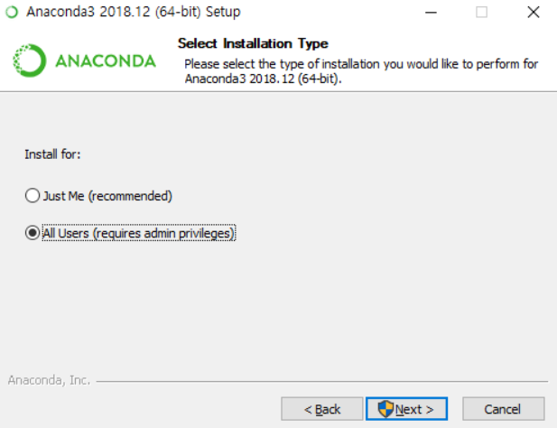
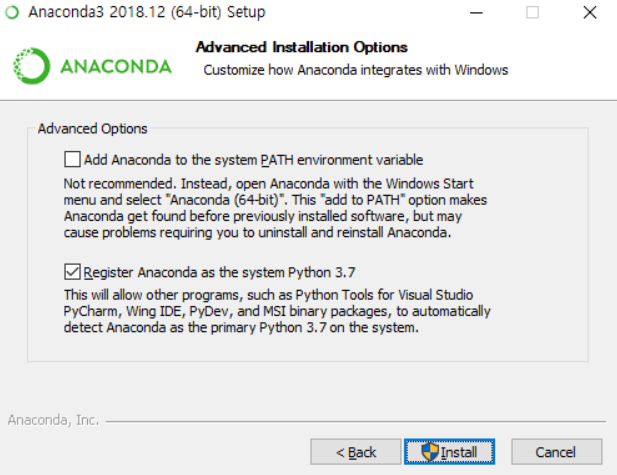

# Basic Setting for new

> 개발을 위한 기본적인 Application 등의 세팅


## Git bash

> 참고 블로그 : https://goddaehee.tistory.com/216

- Git 사이트 접속
  - https://git-scm.com/download/
- 운영체제 맞게 설치
- 이후 default 값으로 설정 후 설치 진행

## VS code

- 공식 사이트 접속
  - https://code.visualstudio.com/docs/?dv=win64
- bash terminal 기본 설정
  - `ctrl` + `,` 설정
  - terminal.integrated.shell.windows 입력
  - `default terminal` git bash로 설정
  - 

## Typora

- 주의 사항 

  - 파일/환경설정/이미지
    - 경로 설정

  


## JIRA

## DOCKER

## Kubernetes


## Anaconda

> 수학 및 과학 패키지들을 기본적으로 포함하고 있는 파이썬 배포판

-  특징
  - 머신러닝과 데이터 분석 등 다양한 툴 제공
  - 라이브러리 간 다양한 의존성 존재 
  - 특정 버전 개발 시 가상 환경 구축

- 설치

  - Install for

    

  - advanced option

    


- Django 설치

  - Prompt

    ```
    pip install Django
    ```

- 가상환경 설치

  - Prompt

    ```
    pip install virtualenvwrapper
    ```

