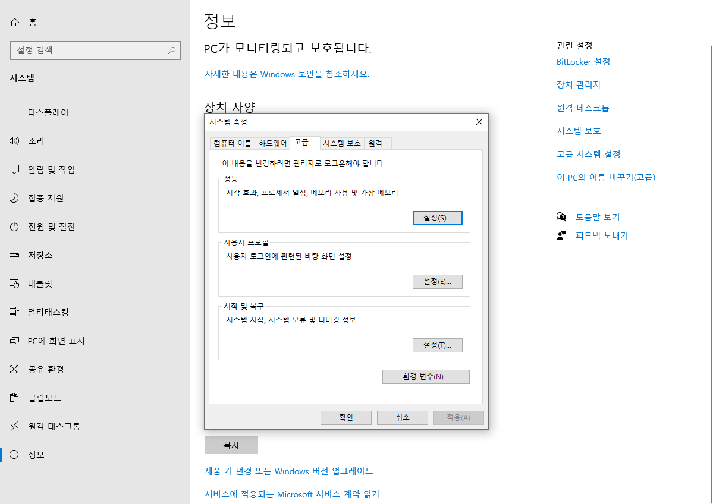
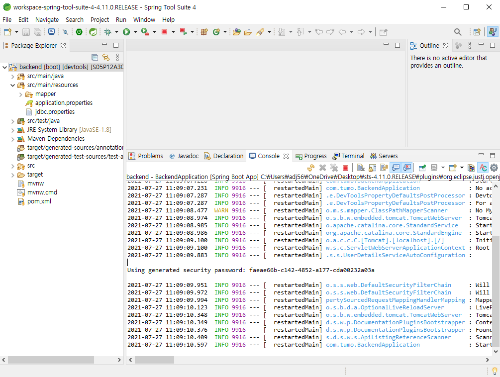

# STS 설치 및 실행방법

### 1. 개발 환경 세팅

1. JDK 설치 및 환경변수 세팅

   - [OPEN JDK Zulu](https://www.azul.com/downloads/?package=jdk#download-openjdk) 에서 Open JDK 다운로드 (Java 8 버전) 

   

   .msi로 받은 후 설치하시면 됩니다.

   

   - 내 PC - 속성 - 고급 시스템 설정 - 환경 변수

   

   

   - 시스템 변수 - 새로 만들기 - JAVA_HOME 추가

     

     

   - 시스템 변수 - Path 편집 - **%JAVA_HOME%\bin** 추가

     

     

   - 명령 프롬프트 창에서 설치 확인 (java -version)

     

2. STS 설치

   - [STS 공식 홈페이지](https://spring.io/tools/) 에서 Spring Tools 다운로드

     

   - 다운로드 파일 압축 해제 후 contents.zip 압축풀기

     

     

   - SpringToolSuite4.exe 실행 후 Help의 Eclipse Marketplace

     

     

   - sts 검색 후 Spring Tools 3 3.9.14 인스톨

     

     

   - File - Open projects from file system 에서 backend 폴더 import

     

     import source 에서 directory에서 backend 폴더 선택

     

     

   - backend - src/main/resources에 jdbc.properties 파일 추가 (파일은 단톡방에 올려져 있음)

     

### 2. 서버 실행

backend 우클릭 - Run As - Spring boot app

이미 Vue 서버가 켜져 있는 경우 port가 겹쳐 error가 날 수 있음

그 때는 Vue 서버 실행 시

yarn serve --port 3000 으로 vue 프로젝트를 다른 포트로 실행